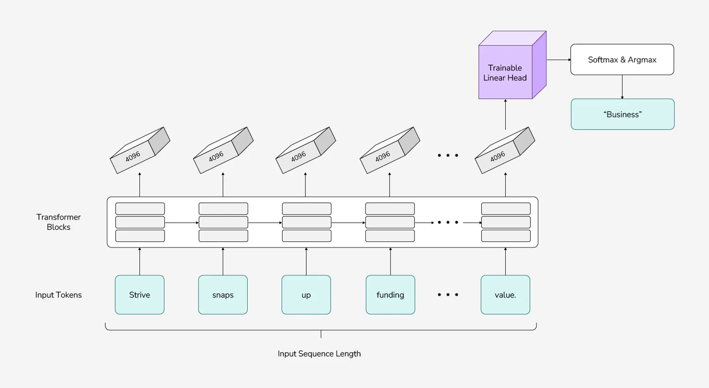

# Multilingual Preference Model

  

This project focuses on building a **multilingual preference model** based on **Cohere 2**, supporting over **20 languages**. The architecture incorporates **sequence classification**, allowing the model to be used both for preference modeling and classification tasks. Fine-tuning was conducted using the **multilingual ORCA DPO dataset**, with optimizations for training efficiency.

## 📌 Project Highlights
- **Multilingual preference modeling**: Built on **Cohere 2**, supporting over **20 languages**  
- **Sequence classification**: Added a classification head for flexible usage in various tasks  
- **Fine-tuning with ORCA DPO dataset**: Improved cross-lingual preference understanding  
- **Optimized training**: Used **LoRA adapters** to reduce computational overhead while maintaining performance  
- **Evaluation**: Achieved **~70% accuracy** on a test set (5% subset of the training data)  

## 🏗️ Model Pipeline
The preference model is used in **RLHF (Reinforcement Learning from Human Feedback)** training.

## 🧠 Model Architecture
The model is based on **Cohere 2** with an added **sequence classification** head, making it adaptable for both **preference modeling and classification tasks**.

**Promppt Engineering:** The input consists of a prompt + Response A + Response B, then input is passed to model classifying which response is better.

## 🚀 Model and Training Resources
- **Base Model**: [dpquoc/init-cohere2-seq](https://huggingface.co/dpquoc/init-cohere2-seq)  
- **Fine-Tuned LoRA Model**: [dpquoc/cohere2-seq-lora_2](https://huggingface.co/dpquoc/cohere2-seq-lora_2/tree/main)  
- **Dataset**: [multilingual/orca_dpo_pairs](https://huggingface.co/datasets/multilingual/orca_dpo_pairs)  
- **Training Report**: [Weights & Biases Report](https://api.wandb.ai/links/dpquoc-openai/3c3j635r)  

## 🛠 Tools Used
- [Hugging Face Transformers](https://huggingface.co/docs/transformers/index)
- [LoRA (Low-Rank Adaptation)](https://huggingface.co/docs/peft/index)
- [DeepSpeed](https://www.deepspeed.ai/)
- [Cohere 2](https://cohere.com/)
- [Weights & Biases (WandB)](https://wandb.ai/)

## 🔥 Results
The model demonstrated strong multilingual alignment, achieving **~70% accuracy** on a test subset. Future work will focus on further optimization and domain-specific adaptations.

---

### 📬 Contact
For any questions or collaborations, feel free to reach out!
